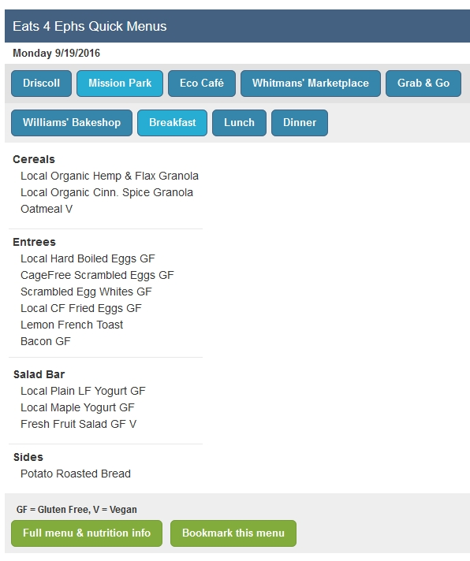

An AngularJS interface utilizing the WordPress REST API. Developed for Williams College, this is a simple app which allows students, faculty and staff to select a dining facility and daypart to view the specified menu. This was my first foray into Angular. The WP side consumes a csv file provided by an antiquated 3rd-party food-service database called NetNutrition and converts it to JSON and distributes it to the Angular client via the WP API.

This repo consists of two plugins. The first, `wms-rest-api`, extends WP API and sets up the necessary endpoints. All the magic happens in `wms-dining-menu-widget`.

[See the Dining Widget in the wild.](http://dining.williams.edu/eats4ephs/?unitid=29&meal=LUNCH)

